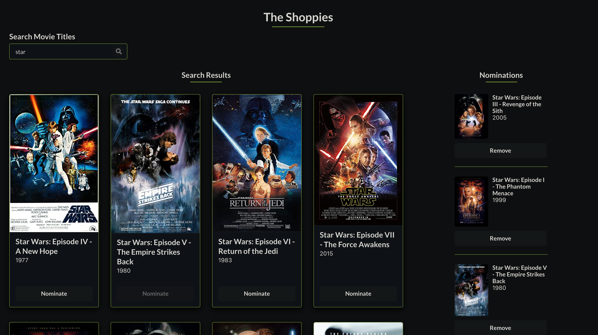

# the-shoppies
Shopify challenge: Movie awards for entrepreneurs. Utilizes React Redux.  
**[Visit the Deployed Site](https://sheplt1.github.io/the-shoppies/)**  

  

## Features
- Search OMDB and display the results (movies only)
- Add a movie from the search results to nomination list
- View the list of films already nominated
- Remove a nominee from the nomination list
- Displays a banner and disables all nomination buttons when the user has 5 nominations
- Preserves list of nominated movies across multiple sessions
- Responsive design with stylish dark theme

## Preview
